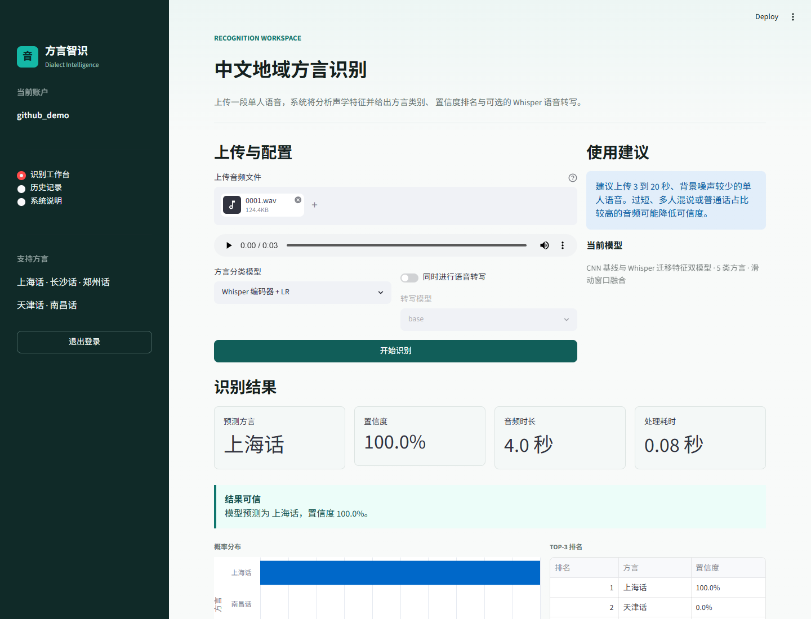
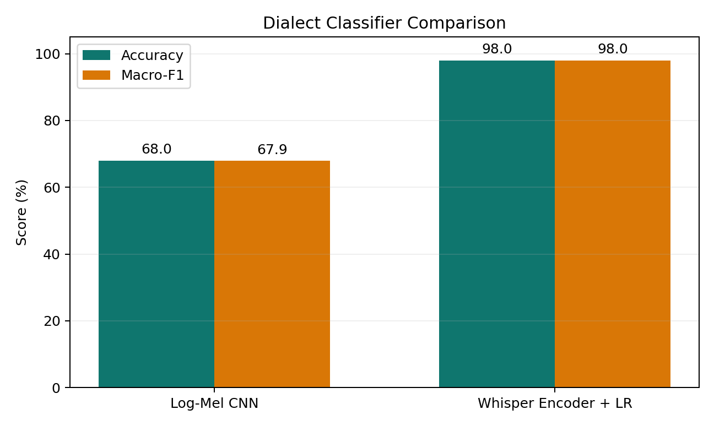
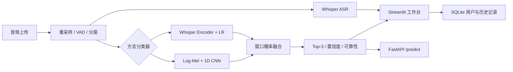

# 中文地域方言识别与语音转写系统

一个面向学习、实验和作品展示的端到端语音系统。项目当前识别上海话、长沙话、郑州话、天津话和南昌话，并提供 Whisper 语音转写、双模型对比、FastAPI 服务、Streamlit 登录工作台、SQLite 历史记录与 Docker 部署。

> 本项目是五类地域语音分类实验，不宣称具备通用中文方言识别能力。



## 核心能力

- `Log-Mel + 1D CNN`：从头训练的轻量基线模型。
- `Whisper base Encoder + Logistic Regression`：冻结预训练编码器的小数据迁移学习方案。
- 长音频滑动窗口推理与概率融合。
- Top-3 类别、置信度阈值和低置信度提示。
- 可选 Whisper ASR 转写。
- 注册登录、PBKDF2 密码哈希和 SQLite 个人历史记录。
- FastAPI、OpenAPI 文档、统一错误响应和上传限制。
- Docker Compose 同时运行 API 与 Web。
- pytest 单元测试和可复现的实验产物。

## 模型实验

数据按类别进行 `80%/20%` 随机划分，随机种子为 `42`，训练集 200 条，测试集 50 条。

| 模型 | 特征 | 分类器 | Accuracy | Macro-F1 |
| --- | --- | --- | ---: | ---: |
| CNN 基线 | 80 维 Log-Mel + CMVN | 1D CNN | 68.0% | 67.9% |
| 迁移特征模型 | Whisper base Encoder 均值/标准差池化 | Logistic Regression | **98.0%** | **98.0%** |



### 实验限制

当前结果来自小规模随机划分。下载数据中只有长沙语料保留了说话人字段，且 50 条长沙数据来自同一说话人；其余类别缺少说话人标识，因此暂时无法完成严格的 speaker-disjoint 测试。Whisper 模型的高分可能同时利用了说话人、录音设备或语料库通道特征，不能直接理解为跨场景泛化准确率。

可复现实验：

```bash
python -m src.train_did
python -m src.train_whisper_classifier --feature-model base
python -m src.eval_all --classifiers cnn whisper
python scripts/generate_report_assets.py
```

详细指标保存在 `outputs/experiment_results.json`，逐条预测和混淆矩阵也会写入 `outputs/`。

## 系统架构



## 数据说明

当前使用 [TingChen-ppmc](https://huggingface.co/TingChen-ppmc) 发布的中文地域会话语音子集，每类下载 50 条：

| 类别 | 样本数 | 当前划分 |
| --- | ---: | ---: |
| 上海话 | 50 | 40 / 10 |
| 长沙话 | 50 | 40 / 10 |
| 郑州话 | 50 | 40 / 10 |
| 天津话 | 50 | 40 / 10 |
| 南昌话 | 50 | 40 / 10 |

音频不提交到 GitHub。下载和生成 CSV：

```bash
python scripts/download_hf_dialects.py --limit 50
python make_csv.py
```

## 快速开始

推荐 Python 3.11，安装 `ffmpeg` 后执行：

```bash
python -m venv .venv
.venv\Scripts\activate
pip install -r requirements.txt
```

启动 Web：

```bash
streamlit run streamlit_app.py
```

访问 `http://localhost:8501`，首次使用先注册本地账户。

启动 API：

```bash
uvicorn app:app --host 127.0.0.1 --port 8000
```

- Swagger UI: `http://127.0.0.1:8000/docs`
- ReDoc: `http://127.0.0.1:8000/redoc`
- Health: `http://127.0.0.1:8000/health`

API 示例：

```bash
curl -X POST \
  "http://127.0.0.1:8000/predict?classifier=whisper&run_asr=false" \
  -F "file=@sample.wav"
```

## Docker

```bash
docker compose up --build
```

- Web: `http://localhost:8501`
- API: `http://localhost:8000`

Whisper 权重首次使用时下载到命名卷。SQLite 数据同样通过 Docker volume 持久化。

## 测试

```bash
pytest -q
```

测试覆盖账户认证、密码哈希、历史记录隔离、API 输入校验、响应结构、音频分窗和非法模型选择。

## 配置与日志

可用环境变量见 `.env.example`：

```text
DIALECT_DEFAULT_CLASSIFIER=whisper
DIALECT_WHISPER_FEATURE_MODEL=base
DIALECT_CONFIDENCE_THRESHOLD=0.55
DIALECT_MAX_UPLOAD_MB=25
```

应用日志同时输出到终端和 `logs/dialect_app.log`，采用轮转策略。

## 项目结构

```text
.
├── app.py                         # FastAPI 服务与 OpenAPI 模型
├── streamlit_app.py               # 登录工作台与识别历史
├── docker-compose.yml
├── tests/
├── scripts/
│   ├── download_hf_dialects.py
│   └── generate_report_assets.py
├── src/
│   ├── config.py                  # 统一配置
│   ├── database.py                # SQLite 与账户认证
│   ├── pipeline.py                # 双模型统一推理流水线
│   ├── train_did.py               # CNN 基线训练
│   ├── whisper_classifier.py      # Whisper 特征推理
│   ├── train_whisper_classifier.py
│   └── eval_all.py                # 统一评估
└── outputs/
```

## 简历描述参考

设计并实现中文地域方言识别与语音转写系统，构建 Log-Mel 1D CNN 基线与冻结 Whisper 编码器迁移特征方案；在五类、250 条小规模地域语音数据上完成统一评估，随机划分测试 Accuracy 从 68% 提升至 98%。进一步实现滑动窗口推理、置信度拒识、FastAPI/OpenAPI、Streamlit 登录工作台、SQLite 历史记录、Docker Compose 与 pytest 测试，并分析说话人泄漏和跨域泛化风险。

## 参考

- [OpenAI Whisper](https://github.com/openai/whisper)
- [Hugging Face Datasets](https://huggingface.co/docs/datasets/)
